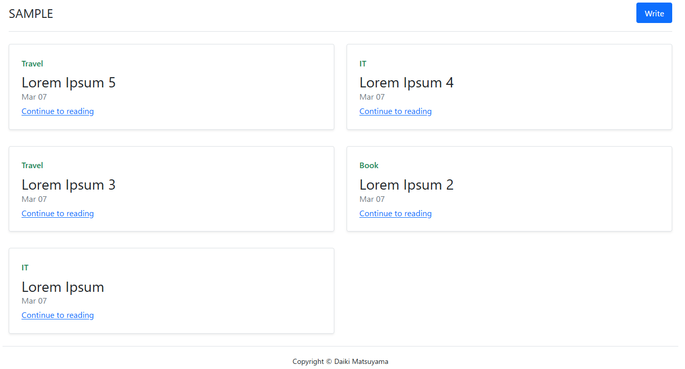
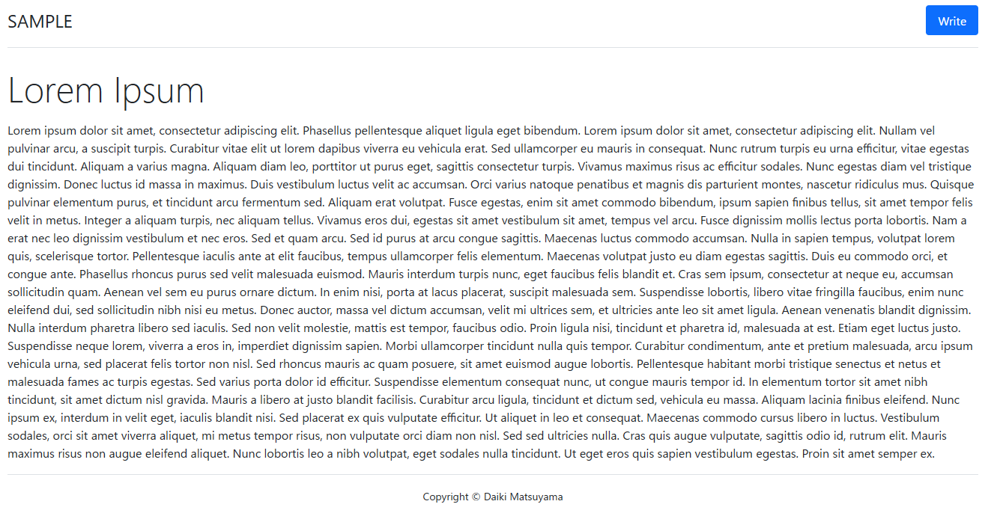
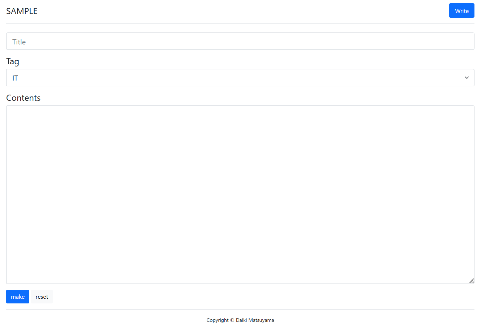

# Simple blog site sample implemented with Golang

[](https://github.com/dkmats/go-blog-app)
[](https://github.com/dkmats/go-blog-app/blob/main/LICENSE)

This is a simple blog site sample.

## Installation

First, go to the directory where you want to place this repository, and then execute following commands.
```bash
$ git clone https://github.com/dkmats/blog-app-sample.git
$ cd ./blog-app-sample
$ go mod tidy
```

## Execution

To run this application, the following command need to be executed.
```bash
$ go run .
```

Aternatively, it is possible to build once and run the generated executable like following.
```bash
$ go build .
$ ./go-blog-app
```

## Screenshots
### blog index page


### blog article page


### blog writing page


## License

[MIT](LICENSE)
